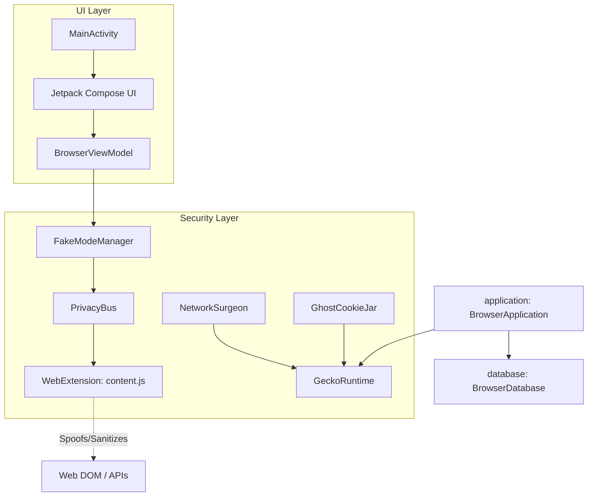

# JusBrowse Current State - Documentation Overhaul

## 1. What was completed
- **README.md Overhaul**: Professionalized the landing page with core pillars, major features, and clear documentation links.
- **Detailed Technical Docs**: Created `SECURITY_CLAIMS.md` (fingerprinting deep-dive), `DOCUMENTATION.md` (architecture update), and `INSTALLATION.md` (build guide).
- **Project Structure & Policy**: Created `FAQ.md`, `ROADMAP.md`, `CONTRIBUTING.md`, and `SECURITY.md`.
- **Architecture Validation**: Verified component roles (NetworkSurgeon, PrivacyBus, etc.) against the Kotlin/JS implementation and documented their interactions.

## 2. Current System Architecture
The browser is built on **GeckoView** (Firefox engine), departing from the legacy Android WebView.

- **Enforcement**: Privacy protections are applied at the engine level (RFP flags) and JS injection level (WebExtension).
- **Isolation**: Each persona has a unique `contextId` ensuring isolated storage and cookies.
- **Network**: All networking is handled by GeckoRuntime with customized interceptors (NetworkSurgeon).

## 3. Next Three Concrete Priorities
1. **APK Size Optimization**: Finalize ABI splits and R8/ProGuard rules to reduce the 200MB+ footprint.
2. **Search Engine Verification**: Ensure the new "Custom Search Engine" feature is stable and correctly handles various URL templates.
3. **Beta Feature Implementation**: Start work on Phase 2 items, specifically "Tab Groups" and "Encrypted Backups."
