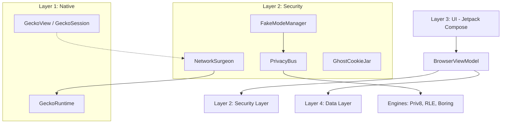

# JusBrowse: Technical Documentation (based on Alpha 6 test 2 / v0.0.6-T2)

## 1. Overview
JusBrowse is a high-security, privacy-focused Android web browser built with Jetpack Compose. It is a **GeckoView-based** browser, employing advanced techniques typically found in anti-detect browsers or cybersecurity research tools to protect user identity and prevent fingerprinting.

---

## 2. System Architecture
JusBrowse follows a multi-layered architectural pattern to separate UI, business logic, and security enforcement.

---

## 3. Core Features & Capabilities

### 🛡️ Deep Privacy Protection
*   **Fake Mode & Personas**: Users can select "Golden Profiles" (e.g., Pixel 8 Pro, Galaxy S24 Ultra). JusBrowse then spoofs every identifiable metric (User-Agent, Screen Size, Battery Level, GPU Renderer, CPU Cores, RAM) to match that profile perfectly via GeckoView arguments and WebExtension injection.
*   **Fingerprinting Protection**: Powered by GeckoView's `resistFingerprinting` and JusBrowse's custom WebExtension. Dynamic JS injection intercepts and "glows" sensitive APIs (Canvas, AudioContext, WebRTC, Client Hints) to prevent tracking.
*   **Network Interception (Network Surgeon)**: Unlike the legacy WebView stack, GeckoView provides a more secure and isolatable network engine. JusBrowse enforces HTTPS-only and strips tracking headers at the source.
*   **Ghost Cookie Jar**: Implements per-tab cookie isolation using GeckoView's `contextId`. Cookies from one tab or persona never leak to another.
*   **Bridge Randomization**: The JavaScript bridges used for communication between the web and native layers are randomized per session, making it impossible for sites to detect the browser's presence.

### 🚀 Performance & Connectivity
*   **GeckoView Engine**: Uses the Firefox rendering engine for superior privacy, security, and standards support.
*   **DNS-over-HTTPS (DoH)**: All DNS queries are routed through secure, encrypted providers (like Cloudflare) directly integrated into the GeckoRuntime.
*   **Persona Isolation**: Each persona runs with its own isolated session and data context, ensuring OS-level and engine-level isolation.

### 🎨 Premium User Experience
*   **Freeform Workspace**: A desktop-like multi-view mode where tabs appear as draggable, resizable windows.
*   **Airlock Media System**: A powerful media extractor that pulls images, videos, and audio from any page into a clean, glassmorphic gallery for viewing or downloading.
*   **Glassmorphism inspired UI**: High-fidelity interface using translucency, and smooth animations (Material 3 Expressive).
*   **Stickers at Start Page**: A customizable home screen where users can add interactive widgets and shortcuts.

---

## 4. How It Works (Technical Deep-Dive)

### 🩺 Network Surgeon & Interception
The `NetworkSurgeon` provides a clean networking environment.
1.  **Surgery**: Enforces persona-consistent headers (Client Hints, User-Agent) via the `GeckoRuntime` arguments and internal delegates.
2.  **Disguise**: Injects JS to hide the real browser engine's fingerprint.
3.  **Isolation**: Uses `GhostCookieJar` for memory-only cookie storage (when applicable).

### 🎭 Privacy Bus & Engines
When a page loads, JusBrowse injects a sophisticated protection script generated by `FakeModeManager` via the `PrivacyBus` and a built-in WebExtension.
*   **Priv8 Engine**: Flattens real device data into generic "buckets."
*   **RL Engine (RLE)**: "Glows" the flattened data by applying the selected Persona's characteristics.
*   **Boring Engine**: Provides a stable, low-entropy identity for standard protection.
*   **Surgical Injection**: Use of `Mulberry32` deterministic PRNG ensures that noise added to Canvas or Audio APIs is stable for the session.

### 📂 Data Isolation
JusBrowse utilizes gecko sessions with distinct `contextId` values. This ensures that the engine itself keeps data strictly separate. History and Bookmarks are stored in a Room database (`BrowserDatabase`), which is also partitioned by Persona ID.

---

## 5. Security Protocols
*   **Telemetry Policy**: No behavioral tracking, analytics, or user profiling (no Google Analytics, 
    Firebase, or Sentry). We collect:
**Install Events** (non-opt-out): Sent on first app launch. Contains only 
   installation ping (if app is installed)
    - **Daily Active User** (opt-out): Anonymous "user opened app today"
    
    All metrics are anonymized and sent to the developer's firebase database. 
    Opt-out available in Settings, under "privacy" section.
*   **HTTPS Enforcement**: Native HTTPS-only mode enforced via GeckoRuntime.

---

## 6. Core Security Modules

### 🩺 NetworkSurgeon (`NetworkSurgeon.kt`)
The **NetworkSurgeon** is the gatekeeper of the network stack. It interfaces directly with the `GeckoRuntime` to:
- **Header Surgery**: Strip tracking headers (Referer, ETag) and inject persona-consistent Client-Hints.
- **Protocol Enforcement**: Force HSTS and upgrade all insecure requests to HTTPS.
- **Stealth Routing**: Coordinates with the global DoH settings.

### 🎭 FakeModeManager (`FakeModeManager.kt`)
The brain behind the persona system. It handles:
- **Persona Lifecycle**: Loading, saving, and switching between "Golden Profiles."
- **Session Randomization**: Generates stable session seeds for noise injection and randomizes native bridge names.
- **State Drift**: Simulates realistic battery drain and charging status for the Javascript Battery API.

### 🚌 PrivacyBus (`PrivacyBus.kt`)
The central communication hub that links the native Kotlin logic with the Javascript injection layer.
- **Packet Delivery**: Sends `PrivacyPacket` data (Screen, UA, Hardware signatures) to the WebExtension.
- **Event Forwarding**: Relays security alerts (Suspicion Points) back to the `SuspicionScorer`.

### 👻 GhostCookieJar (`GhostCookieJar.kt`)
A specialized cookie manager that prevents persistent tracking.
- **Volatile Storage**: Ensures that cookies for restricted personas are never written to disk, remaining in-memory only.
- **Context Isolation**: Leverages GeckoView's `contextId` to keep tab data strictly partitioned.

---

## 7. Glossary of Key Files

| File | Responsibility |
| :--- | :--- |
| **`GeckoWebView.kt`** | Custom wrapper around GeckoView providing the primary browsing interface. |
| **`FakeModeManager.kt`** | Manages personas, session seeds, and bridge randomization. |
| **`content.js`** | The "Shield." Injected at `document_start` to sanitize and spoof JS APIs. |
| **`AirlockDiscoveryBus.kt`** | Orchestrates the extraction of media from the rendered DOM. |
| **`FreeformWorkspace.kt`** | Desktop-like multi-view logic for draggable browser windows. |
| **`SuspicionScorer.kt`** | Tracks trackers. High "Suspicion Points" can trigger an automatic Airlock or Reset. |
